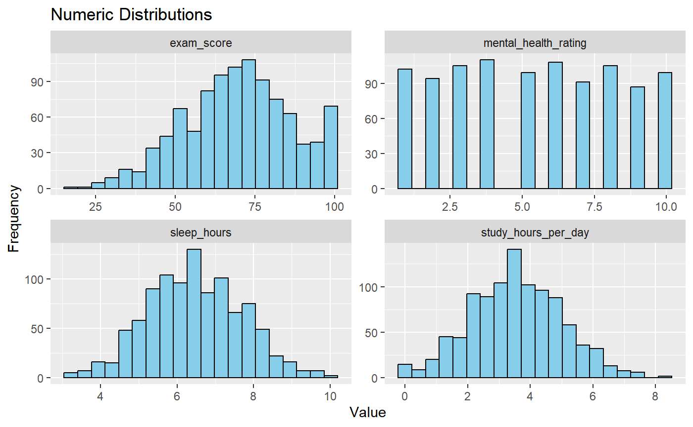
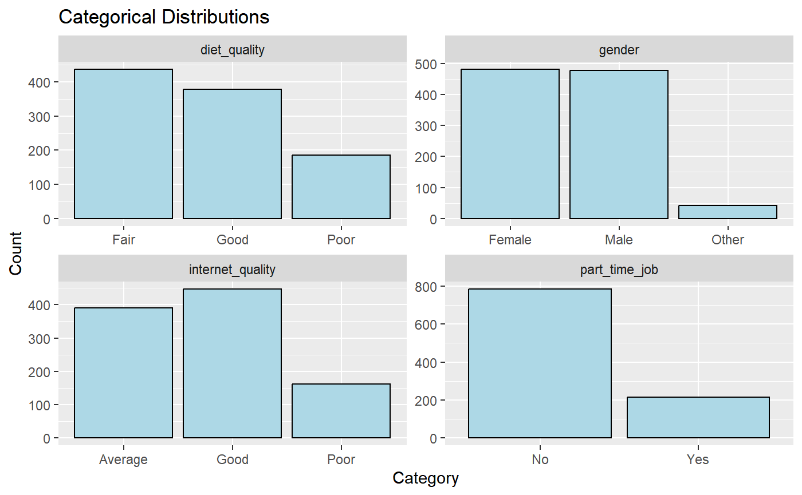
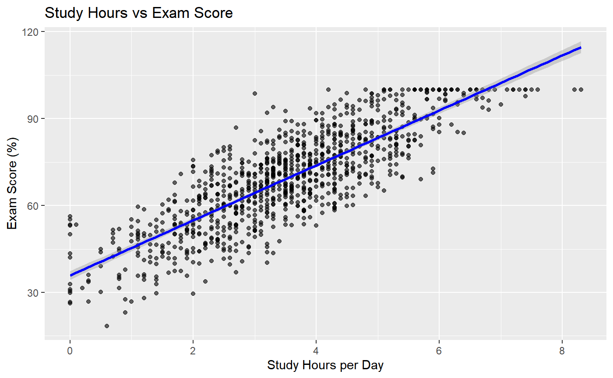
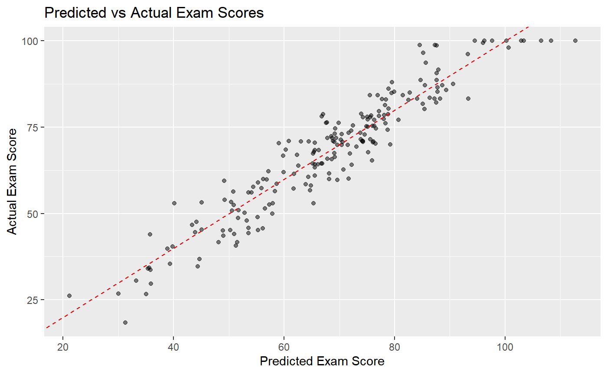
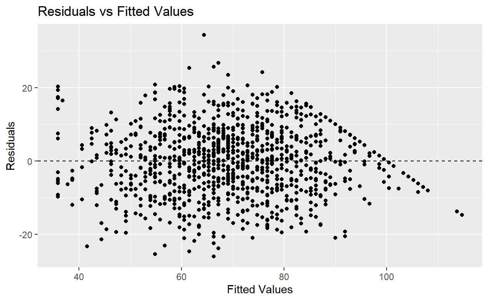

# 📘 2025 CDSD Project: Student Habits and Academic Performance

**Authors**: Jaewoong Choi, Seonghee Park, Joseph Kim, Hyunha Noh  
**Course**: CDS 102 – Introduction to Data Science  
**Date**: 2025/05/20  

---

## 📌 Project Overview

This project analyzes the relationship between students’ daily habits and their academic performance. Using the **Student Habits vs Academic Performance** dataset from Kaggle, we explore how study hours, sleep, screen time, attendance, and mental health influence exam scores. The project includes data cleaning, visualization, regression modeling, and hypothesis testing.

---

## 📂 Dataset Information

- **Source**: [Kaggle – Student Habits vs Academic Performance Dataset](https://www.kaggle.com/datasets/jayaantanaath/student-habits-vs-academic-performance)  
- **Full Report**: [**Click here to view the full report**](https://github.com/Jaewoong-GMU/2025-CDSD-Project/raw/main/project.pdf)  
- **Description**: A synthetic dataset of 1,000 students including lifestyle, well-being, and academic metrics.

### 🔑 Key Variables

| Variable                    | Description                                      | Type        |
|-----------------------------|--------------------------------------------------|-------------|
| `study_hours_per_day`       | Average daily study time (hours)                 | Numeric     |
| `sleep_hours`               | Average daily sleep (hours)                      | Numeric     |
| `mental_health_rating`      | Mental health score (1–10)                       | Numeric     |
| `exam_score`                | Final exam score (%)                             | Numeric     |
| `social_media_hours`        | Daily social media use (hours)                   | Numeric     |
| `netflix_hours`             | Daily Netflix viewing (hours)                    | Numeric     |
| `part_time_job`             | Has a part-time job (Yes/No)                     | Categorical |
| `attendance_percentage`     | Class attendance rate (%)                        | Numeric     |
| `diet_quality`              | Quality of diet (Poor/Fair/Good)                 | Categorical |
| `internet_quality`          | Internet access quality (Poor/Average/Good)      | Categorical |
| `parental_education_level`  | Highest education level of parents               | Categorical |

---

## 🧠 Project Goals

- Understand how study time, sleep, screen usage, and well-being influence academic outcomes  
- Use regression analysis to predict exam scores  
- Test hypotheses on group differences (e.g., job vs no job)  
- Clean, visualize, and model structured data in R  

---

## 📈 Methods and What We Found

### ✅ Data Cleaning & Feature Engineering

- Filled missing values in `parental_education_level` using the mode  
- Created new variables:  
  - `total_screen_time` = `social_media_hours` + `netflix_hours`  
  - `well_being` = `sleep_hours` + `mental_health_rating`  

---

## 📊 Exploratory Data Analysis

**What We Did**:
- Histograms for numeric variables  
- Bar plots for categorical variables  

### 📷 Numeric Variable Distributions  
  
*This histogram set shows how exam scores, sleep hours, mental health ratings, and study hours are distributed.*

### 📷 Categorical Variable Distributions  
  
*This bar chart shows frequencies for part-time job status, diet quality, and internet quality.*

---

## 📉 Regression Analysis

### 1. Simple Linear Regression

**Model**:
```
ŷ = β₀ + β₁x
```
Where `x` is `study_hours_per_day`, and `ŷ` is the predicted exam score.

**Results**:
- Intercept: 35.91  
- Coefficient: +9.49  
- R² ≈ 0.68  

**Interpretation**:  
Each additional study hour is associated with ~9.49 point increase in exam score.

### 📷 Study Hours vs Exam Score  


---

### 2. Multiple Linear Regression

**Model**:
```
ŷ = β₀ + β₁x₁ + β₂x₂ + ... + βₙxₙ
```

**Variables Used**:  
- `study_hours_per_day`, `sleep_hours`, `attendance_percentage`, `mental_health_rating`, `total_screen_time`

**Results**:

| Predictor               | Coefficient |
|-------------------------|-------------|
| `study_hours_per_day`   | +9.51       |
| `sleep_hours`           | +2.05       |
| `attendance_percentage` | +0.14       |
| `mental_health_rating`  | +1.95       |
| `total_screen_time`     | –2.52       |

- R² ≈ 0.87  

**Interpretation**:  
Multiple lifestyle factors jointly explain 87% of exam score variance.

---

## ⚙️ Model Evaluation

**Metric**:
```
RMSE = sqrt((1/n) × Σ(yᵢ - ŷᵢ)²)
```

**Results**:
- Train RMSE: 6.20  
- Test RMSE: 5.58  

**Interpretation**:  
Predictions are accurate within ±5.6 points on the test set.

### 📷 Predicted vs Actual Exam Scores  


### 📷 Residuals vs Fitted Values  


---

## 🧪 Statistical Inference – t-Test

**What We Did**:
- Conducted a two-sample t-test on `exam_score ~ part_time_job`

**Results**:
- p-value ≈ 0.395  
- Mean difference: –1.09  

**Interpretation**:  
No significant difference in scores between students with or without part-time jobs.

---

## 🧾 Conclusion

📚 **Study time** had the strongest positive effect  
🧠 **Mental health** and 💤 **sleep** boosted scores  
📱 **Excessive screen time** lowered performance slightly  
👷 **Part-time work** had no significant effect

---

## 🛠️ Tools & Technologies

- **Language**: R  
- **Libraries**: `tidyverse`, `ggplot2`, `infer`, `modelr`, `janitor`  
- **Techniques**: Data wrangling, regression modeling, hypothesis testing, visualization

---

## 📚 References

- 📖 [Kaggle Dataset](https://www.kaggle.com/datasets/jayaantanaath/student-habits-vs-academic-performance)  
- 📖 [ModernDive: Chapter 5 – Simple Regression](https://moderndive.com/5-regression.html)  
- 📖 [ModernDive: Chapter 6 – Multiple Regression](https://moderndive.com/6-multiple-regression.html)  
- 📖 [ModernDive: Chapter 9 – Hypothesis Testing](https://moderndive.com/9-hypothesis-testing.html)

---

## 📄 License

This project is licensed under the MIT License. See the `LICENSE` file for details.

---

👉 [**Click to View the Full Report**](https://github.com/Jaewoong-GMU/2025-CDSD-Project/raw/main/project.pdf)
